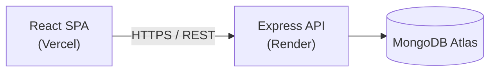

<div align="center">

# FootballWithMe

Full-stack football news platform — articles, search, favorites, comments, media uploads, and an admin dashboard for content management.

[](https://react.dev)
[](https://expressjs.com)
[](https://www.mongodb.com)
[](https://vitejs.dev)
[](https://tailwindcss.com)
[](https://footballwithme-base.vercel.app)
[](https://footballwithme-backend.onrender.com)

[Live Demo](https://footballwithme-base.vercel.app) · [Report an Issue](#)

</div>

---

## Table of Contents

- [Overview](#overview)
- [Tech Stack](#tech-stack)
- [Architecture](#architecture)
- [Project Structure](#project-structure)
- [Getting Started](#getting-started)
- [Environment Variables](#environment-variables)
- [API Reference](#api-reference)
- [Deployment](#deployment)

## Overview

FootballWithMe is a full-stack content platform for football news, built as a React + Express + MongoDB monorepo. It ships with public-facing article browsing, search, favorites, threaded comments, reactions, and view-based popularity ranking, plus a protected admin dashboard for managing posts, users, and site activity.

| Capability | Description |
|---|---|
| Content | Browse articles by category, view article detail pages, per-article view counts, view-based "Popular" ranking |
| Search | Full-text search across articles |
| Engagement | Favorite articles, threaded comments (1-level replies), 4-type reactions (like/dislike/haha/angry) |
| Notifications | In-app bell (unread badge, updates on navigation + polling) and email alerts when someone replies to your comment |
| Auth | JWT-based registration/login, Google Sign-In, email verification, forgot/reset password, change password, account deletion |
| Media | Avatar, cover image, and video uploads via Cloudinary |
| Admin | Dashboard to manage posts (paginated table), users, and a site-wide visitor access log |
| Contact | Contact form emails the site admin directly, with reply-to set to the sender |
| SEO | Dynamic `sitemap.xml` + `robots.txt`, Google Search Console verification |
| i18n | Multi-language UI support |

## Tech Stack

**Frontend** — `frontend-rebuild/`

| Layer | Technology |
|---|---|
| Framework | React 19, React Router 7 |
| Build tool | Vite 8 |
| Styling | Tailwind CSS 4 |
| Rich text | Tiptap |
| i18n | Custom dictionary-based i18n |

**Backend** — `backend/`

| Layer | Technology |
|---|---|
| Runtime | Node.js, Express 5 |
| Database | MongoDB, Mongoose |
| Auth | JWT, bcrypt, Google Identity Services (`google-auth-library`) |
| Media storage | Cloudinary, Multer |
| Email | Resend (verification, password reset, reply notifications, contact form) |
| Security | Helmet, express-rate-limit, sanitize-html |

**Infrastructure**

| Service | Provider |
|---|---|
| Frontend hosting | Vercel |
| Backend hosting | Render |
| Database | MongoDB Atlas |

## Architecture



## Project Structure

```
footballwithme/
├── backend/                 # REST API
│   └── src/
│       ├── models/          # User, Post, Comment, Reaction, Notification, VisitLog
│       ├── routes/          # auth, posts, users, comments, reactions, logs, notifications, contact, upload
│       ├── controllers/      # business logic per resource
│       ├── middleware/       # auth guard (protect/adminOnly/optionalAuth), upload (Multer), rate limit, error handler
│       ├── utils/            # sendResetEmail, sendVerificationEmail, sendReplyNotification, sendContactEmail
│       └── config/          # DB connection, Cloudinary, Resend mailer
├── frontend-rebuild/         # Active frontend
│   └── src/
│       ├── pages/           # Home, Category, ArticleDetail, Admin, ...
│       ├── components/       # article, comment, reaction, notification, admin, ui, layout, ...
│       ├── context/          # global state (auth, etc.)
│       ├── hooks/            # useComments, useReactions, useNotifications, ...
│       ├── api/              # HTTP client layer
│       └── i18n/
└── frontend/                 # Legacy frontend (superseded by frontend-rebuild)
```

## Getting Started

### Prerequisites

- Node.js ≥ 18
- MongoDB instance (local or Atlas)

### Backend

```bash
cd backend
npm install
cp .env.example .env    # set MONGO_URI, JWT_SECRET, CORS_ORIGIN
npm run dev
```

### Frontend

```bash
cd frontend-rebuild
npm install
npm run dev
```

The frontend reads the API base URL from `VITE_API_URL` in `frontend-rebuild/.env`.

## Environment Variables

**`backend/.env`**

| Variable | Description |
|---|---|
| `MONGO_URI` | MongoDB connection string |
| `JWT_SECRET` | Secret used to sign JWTs |
| `PORT` | Server port (default `5000`) |
| `NODE_ENV` | `development` / `production` |
| `CORS_ORIGIN` | Allowed frontend origin(s) |
| `FRONTEND_URL` | Frontend base URL, used to build email verification / password reset links |
| `GOOGLE_CLIENT_ID` | OAuth Client ID used to verify Google Sign-In tokens |
| `CLOUDINARY_CLOUD_NAME` | Cloudinary account cloud name |
| `CLOUDINARY_API_KEY` | Cloudinary API key |
| `CLOUDINARY_API_SECRET` | Cloudinary API secret |
| `RESEND_API_KEY` | API key for Resend (transactional email) |
| `ADMIN_EMAIL` | Recipient address for contact-form emails |

> `dotenv.config()` must run before any module that reads `process.env` at import time (e.g. `config/cloudinary.js`, `config/mailer.js`) — in `server.js` it is the first line for this reason.

**`frontend-rebuild/.env`**

| Variable | Description |
|---|---|
| `VITE_API_URL` | Base URL of the backend API |
| `VITE_GOOGLE_CLIENT_ID` | OAuth Client ID for the Google Sign-In button (same value as backend's `GOOGLE_CLIENT_ID`) |

> Vite only reads `.env` at dev-server startup and inlines `VITE_*` vars at build time — restart `npm run dev` / trigger a new build after changing them.

## API Reference

Base URL: `/api`

| Method | Endpoint | Description |
|---|---|---|
| `GET` | `/health` | Health check |
| **Auth** | | |
| `POST` | `/auth/register` | Register a new user (sends email verification link, no auto-login) |
| `POST` | `/auth/login` | Authenticate and receive a JWT (blocked until email is verified) |
| `POST` | `/auth/google` | Sign in / sign up with a Google ID token |
| `GET` | `/auth/me` | Get the current authenticated user |
| `POST` | `/auth/favorites/:postId` | Toggle a post as favorite |
| `POST` | `/auth/verify-email` | Verify an account via emailed token |
| `POST` | `/auth/resend-verification` | Resend the verification email |
| `POST` | `/auth/forgot-password` | Request a password reset email |
| `POST` | `/auth/reset-password` | Reset password using the emailed token |
| **Users** | | |
| `GET` | `/users/me` | Get the current user's profile |
| `PUT` | `/users/me` | Update name / bio / avatar |
| `PUT` | `/users/change-password` | Change password (current password required unless the account has none yet, e.g. Google-only) |
| `DELETE` | `/users/me` | Delete the current user's account (requires current password unless the account has none, e.g. Google-only); cascades to delete the user's comments |
| `GET` | `/users` | List all users *(admin)* |
| `PUT` | `/users/:id/role` | Update a user's role *(admin)* |
| `DELETE` | `/users/:id` | Delete a user *(admin)* |
| **Posts** | | |
| `GET` | `/posts` | List posts |
| `GET` | `/posts/:id` | Get a single post |
| `POST` | `/posts` | Create a post *(admin)* |
| `PUT` | `/posts/:id` | Update a post *(admin)* |
| `DELETE` | `/posts/:id` | Delete a post *(admin)* |
| `POST` | `/posts/:id/view` | Increment a post's view count, returns the new count |
| **Comments** | | |
| `GET` | `/comments?postId=` | List comments for a post (flat array; replies carry a `parentId`) |
| `POST` | `/comments` | Create a comment or reply (`parentId` optional, flattened to the root comment server-side) |
| `DELETE` | `/comments/:id` | Delete a comment — soft-deletes (keeps the thread, clears the text) if it still has replies, hard-deletes otherwise |
| **Reactions** | | |
| `GET` | `/reactions?postId=` | Get reaction counts (like/dislike/haha/angry) for a post |
| `GET` | `/reactions/me?postId=` | Get the current user's reaction on a post |
| `POST` | `/reactions` | Set a reaction; posting the same type again removes it |
| **Notifications** | | |
| `GET` | `/notifications` | List the current user's recent notifications |
| `GET` | `/notifications/unread-count` | Get the current user's unread notification count |
| `POST` | `/notifications/mark-read` | Mark all of the current user's notifications as read |
| **Logs** *(admin)* | | |
| `POST` | `/logs` | Record a page visit (public; associates the logged-in user if a token is present) |
| `GET` | `/logs?page=&limit=` | Paginated visitor access log *(admin)* |
| **Contact** | | |
| `POST` | `/contact` | Send a contact-form message straight to `ADMIN_EMAIL`, rate-limited |
| **Upload** | | |
| `POST` | `/upload` | Upload an image/video file to Cloudinary, returns its URL |

> `GET /sitemap.xml` and `GET /robots.txt` are served at the site root (not under `/api`) — the sitemap is generated dynamically from current posts and proxied to the frontend domain via a Vercel rewrite so its URLs match the site the crawler is indexing.

## Deployment

| Component | Platform | Config |
|---|---|---|
| Backend | Render | `render.yaml` (free plan, `backend/` root dir) |
| Frontend | Vercel | `frontend-rebuild/vercel.json` (SPA rewrite) |

> The backend's `CORS_ORIGIN` must match the frontend's **production** domain exactly. Vercel preview deployments use per-build URLs and will be rejected unless explicitly whitelisted.

---

<div align="center">

Built as part of a hands-on full-stack learning project.

</div>
