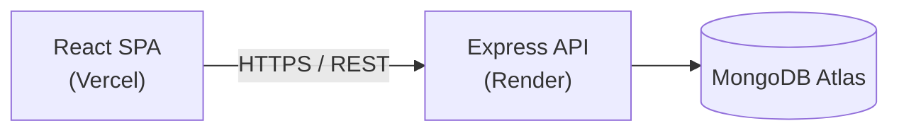

<div align="center">

# FootballWithMe

Full-stack football news platform — articles, search, favorites, comments, and an admin dashboard for content management.

[](https://react.dev)
[](https://expressjs.com)
[](https://www.mongodb.com)
[](https://vitejs.dev)
[](https://tailwindcss.com)
[](https://footballwithme-base.vercel.app)
[](https://footballwithme-backend.onrender.com)

[Live Demo](https://footballwithme-base.vercel.app) · [Report an Issue](#)

</div>

---

## Table of Contents

- [Overview](#overview)
- [Tech Stack](#tech-stack)
- [Architecture](#architecture)
- [Project Structure](#project-structure)
- [Getting Started](#getting-started)
- [Environment Variables](#environment-variables)
- [API Reference](#api-reference)
- [Deployment](#deployment)

## Overview

FootballWithMe is a full-stack content platform for football news, built as a React + Express + MongoDB monorepo. It ships with public-facing article browsing, search, favorites, and comments, plus a protected admin dashboard for managing posts, categories, and comments.

| Capability | Description |
|---|---|
| Content | Browse articles by category, view article detail pages |
| Search | Full-text search across articles |
| Engagement | Favorite articles, post comments |
| Auth | JWT-based registration and login |
| Admin | Dedicated dashboard to manage posts, categories, and comments |
| i18n | Multi-language UI support |

## Tech Stack

**Frontend** — `frontend-rebuild/`

| Layer | Technology |
|---|---|
| Framework | React 19, React Router 7 |
| Build tool | Vite 8 |
| Styling | Tailwind CSS 4 |
| Rich text | Tiptap |
| i18n | Custom dictionary-based i18n |

**Backend** — `backend/`

| Layer | Technology |
|---|---|
| Runtime | Node.js, Express 5 |
| Database | MongoDB, Mongoose |
| Auth | JWT, bcrypt |
| Security | Helmet, express-rate-limit, sanitize-html |

**Infrastructure**

| Service | Provider |
|---|---|
| Frontend hosting | Vercel |
| Backend hosting | Render |
| Database | MongoDB Atlas |

## Architecture



## Project Structure

```
footballwithme/
├── backend/                 # REST API
│   └── src/
│       ├── models/          # User, Post, Comment
│       ├── routes/          # auth, posts, users, comments
│       ├── middleware/       # auth guard, error handler
│       └── config/          # DB connection
├── frontend-rebuild/         # Active frontend
│   └── src/
│       ├── pages/           # Home, Category, ArticleDetail, Admin, ...
│       ├── components/       # article, comment, admin, ui, layout, ...
│       ├── context/          # global state (auth, etc.)
│       ├── hooks/
│       ├── api/              # HTTP client layer
│       └── i18n/
└── frontend/                 # Legacy frontend (superseded by frontend-rebuild)
```

## Getting Started

### Prerequisites

- Node.js ≥ 18
- MongoDB instance (local or Atlas)

### Backend

```bash
cd backend
npm install
cp .env.example .env    # set MONGO_URI, JWT_SECRET, CORS_ORIGIN
npm run dev
```

### Frontend

```bash
cd frontend-rebuild
npm install
npm run dev
```

The frontend reads the API base URL from `VITE_API_URL` in `frontend-rebuild/.env`.

## Environment Variables

**`backend/.env`**

| Variable | Description |
|---|---|
| `MONGO_URI` | MongoDB connection string |
| `JWT_SECRET` | Secret used to sign JWTs |
| `PORT` | Server port (default `5000`) |
| `CORS_ORIGIN` | Allowed frontend origin(s) |

**`frontend-rebuild/.env`**

| Variable | Description |
|---|---|
| `VITE_API_URL` | Base URL of the backend API |

## API Reference

Base URL: `/api`

| Method | Endpoint | Description |
|---|---|---|
| `GET` | `/health` | Health check |
| `POST` | `/auth/register` | Register a new user |
| `POST` | `/auth/login` | Authenticate and receive a JWT |
| `GET` | `/posts` | List posts |
| `GET` | `/users` | User resources |
| `GET/POST` | `/comments` | List / create comments |

## Deployment

| Component | Platform | Config |
|---|---|---|
| Backend | Render | `render.yaml` (free plan, `backend/` root dir) |
| Frontend | Vercel | `frontend-rebuild/vercel.json` (SPA rewrite) |

> The backend's `CORS_ORIGIN` must match the frontend's **production** domain exactly. Vercel preview deployments use per-build URLs and will be rejected unless explicitly whitelisted.

---

<div align="center">

Built as part of a hands-on full-stack learning project.

</div>
